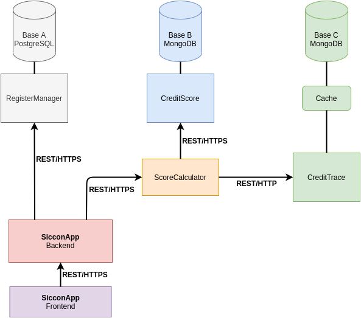

# SicconApp

Um projeto de consulta e cálculo de pontuação de CPFs. A figura a seguir exibe o modo de funcionamento.

  

 

## Funcionamento
O sistema conta com três bases de dados que possuem, respectivamente, três serviços para disponibilização dos dados.
  
**RegisterManager :** utiliza um banco de dados relacional (PostgresSQL*) e retorna informações de cadastro, como: nome, CPF, Endereço e lista de dívidas.
 
_\*Para fins de simplificação, foi utilizado um banco SQLite._
 
**CreditScore :** utiliza um banco de dados não relacional (MongoDB\*) e retorna informações para cálculo de pontuação, como: idade, fontes de renda (tipo, valor financeiro e data de inicio da renda) e bens (tipo do bem e valor financeiro)
 
_\*Para fins de simplificação, foi utilizado um arquivo JSON salvo em disco._
 
**CreditTrace :** utiliza um banco de dados não relacional (MongoDB\*) e retorna informações rastreamento, como: última compra com cartão de crédito (valor, parcelamento e data), última consulta de crédito (instituição, bem desejado, valor monetário e data) e movimentação financeira (entradas e saídas financeiras dos últimos 6 meses)
 
_\*Para fins de simplificação, foi utilizado um dicionário em memória (simulando o cache da imagem acima)._
 
**ScoreCalculator :** este serviço obtém dados dos serviços CreditScore e CreditTrace e gera uma pontuação de crédito para a pessoa. Quanto maior a pontuação, menos arriscada é a operação de crédito.
 
**SicconApp :** aplicativo para consulta de CPFs utilizado por empresas fornecedoras de crédito. Neste software, é possível consultar informações de cadastro e pontuação de determinado CPF.
 

## Execução

Para executar o projeto, execute o seguinte comando na pasta raiz:

    $ [sudo] docker-compose up

O comando acima, executará um container para cada serviço. Para acessar a aplicação, basta acessar o navegador no endereço http://localhost:5000. Para efetuar o login, utilize o seguinte acesso:

    Usuário: admin
    Senha: admin

O sistema possui 5 CPF's cadastrados, que devem ser utilizados para realizar testes nas buscas dos menus Inicio e Score do sistema. Os CPF's cadastrados são os seguintes:

    12312312312
    32132132132
    45645645645
    65465465465
    78978978978
    

Para parar os conteineres, execute

    $ [sudo] docker-compose down

